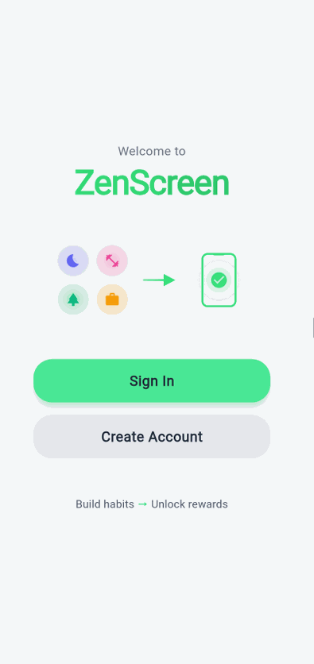
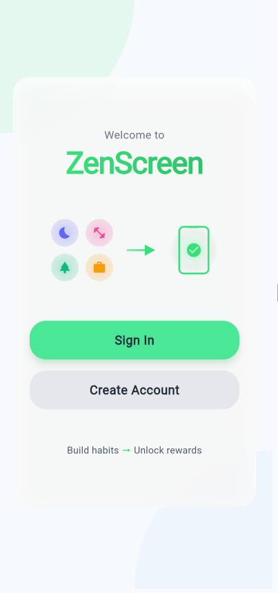
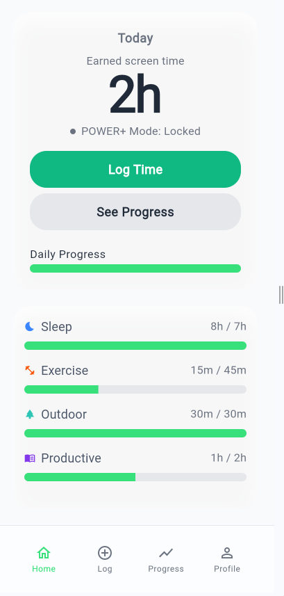
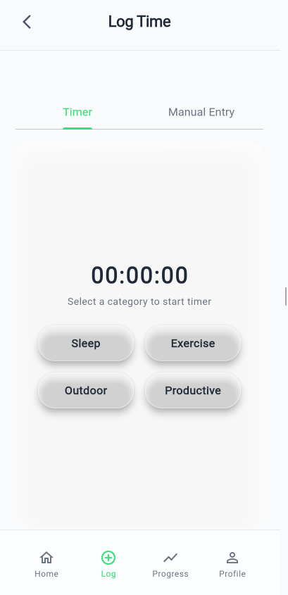
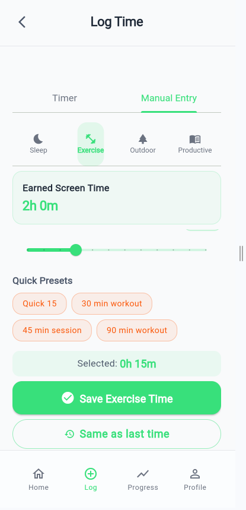
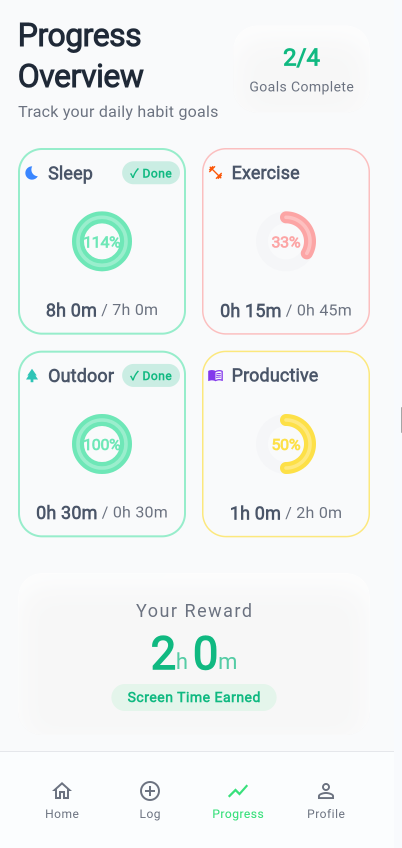
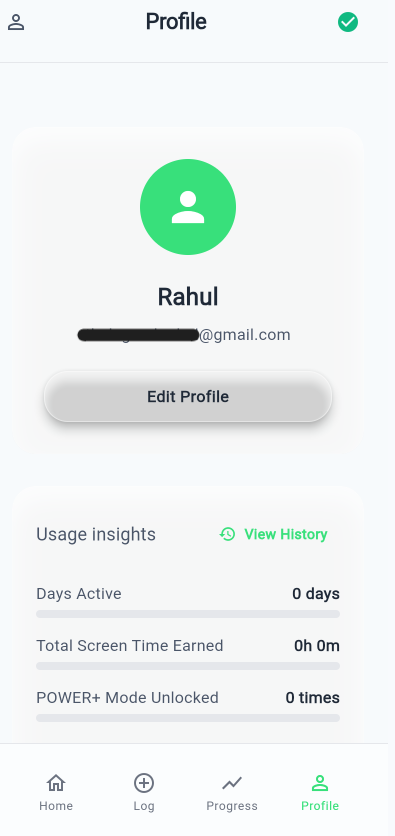
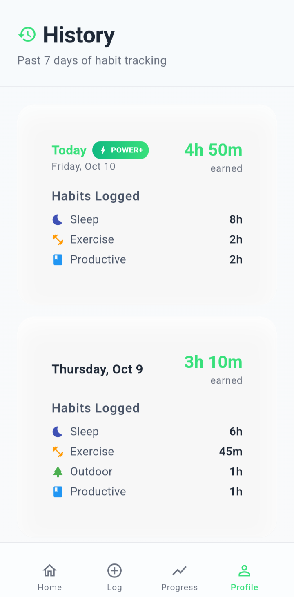

# ZenScreen 🌱

> **Transform screen time guilt into positive habit building**

ZenScreen reimagines digital wellness by letting users *earn* screen time through healthy habits—sleep, exercise, outdoor time, and productive work. Instead of restrictive screen time limits that create guilt, ZenScreen uses positive reinforcement and behavioral science to build lasting healthy habits.

<div align="center">

[](https://flutter.dev)
[](https://firebase.google.com)
[](https://github.com)
[](tests/)

</div>

---

## 📱 See It In Action

<div align="center">

### Complete User Journey


*Experience the full app flow from welcome to habit tracking*

</div>

### App Screenshots

<div align="center">

| Welcome Screen | Home Dashboard | Activity Timer |
|----------------|----------------|----------------|
|  |  |  |
| Clean onboarding with value proposition | Real-time earned time display | Interactive timer for habit tracking |

| Manual Entry | Progress Tracking | Profile & Settings |
|--------------|-------------------|-------------------|
|  |  |  |
| Quick presets & time intervals | Visual progress with motivational feedback | User management and data sync |

| Activity History |
|------------------|
|  |
| Complete activity log with earned time breakdown |

</div>

---

## 🎯 The Problem & Innovation

### The Problem
Traditional screen time apps are **punitive**: they restrict, block, and shame users. This creates anxiety around phone usage without addressing the underlying behavior patterns. Users often disable these apps because they feel controlled rather than empowered.

### The ZenScreen Approach
**Positive reinforcement over punishment.** ZenScreen flips the model:
- ✅ **Earn screen time** by doing healthy activities
- ✅ **Transparent algorithm** based on wellness research
- ✅ **Flexible tracking** with timers or manual entry
- ✅ **POWER+ Mode** rewards achieving daily health goals
- ✅ **No restrictions** - you're always in control

### Target Users
- **Primary**: Young adults (18-35) seeking digital wellness without feeling restricted
- **Secondary**: Professionals wanting better work-life balance
- **Pain Point**: Guilt about screen time but resistance to restrictive solutions

---

## 🧪 How The Algorithm Works

ZenScreen uses a **science-backed earning system** designed by analyzing wellness research:

```
🌙 Sleep:      1 hour = 25 min screen time  (optimal: 7-9 hours)
💪 Exercise:   1 hour = 20 min screen time  (max: 2 hours/day)
🌳 Outdoor:    1 hour = 15 min screen time  (max: 2 hours/day)
📚 Productive: 1 hour = 10 min screen time  (max: 4 hours/day)
```

### POWER+ Mode 🚀
Unlock **30 bonus minutes** by achieving 3 of 4 daily health goals:
- **7+ hours** of sleep
- **30+ minutes** of exercise
- **30+ minutes** outdoors
- **2+ hours** of productive work

**Design Principle**: The earning rates and daily caps are based on CDC guidelines and behavioral psychology research to encourage optimal health behaviors without gamification abuse.

---

## 📊 Product Development Workflow

This project follows a **structured product development approach** from concept to deployment. Here's the framework used:

### 🔍 Phase 1: Research & Strategy
- Conducted competitive analysis of 8+ screen time apps
- Defined clear problem statement and validated with user research
- Developed detailed user personas (Primary, Secondary, Edge Cases)
- Established success metrics and product-market fit framework

### 📋 Phase 2: Product Requirements Document (PRD)
- Created comprehensive PRD covering scope, objectives, and constraints
- Prioritized features using MoSCoW method (Must-have, Should-have, Could-have, Won't-have)
- Defined MVP scope with clear rationale for included/excluded features
- Established technical constraints (offline-first, privacy-by-design, <3s startup)

### 🎨 Phase 3: Design System & UX
- Built complete design system with "liquid glass" aesthetic
- Created 6 interactive wireframes with HTML/CSS prototypes
- Mapped user journeys with edge case analysis
- Established accessibility standards (WCAG AA compliance)
- Chose color psychology: Robin Hood Green (#38e07b) for growth/achievement

### ⚙️ Phase 4: Feature Specifications
- Documented **20+ features** with detailed acceptance criteria
- Each feature includes: user stories, technical requirements, edge cases, data models
- Feature-driven development with clear dependencies
- Established quality gates: 95% test pass rate required

### 🏗️ Phase 5: Technical Architecture
- Designed offline-first architecture with Firebase sync
- Chose Flutter for cross-platform efficiency (single codebase for iOS/Android/Web)
- Implemented Riverpod for type-safe state management
- Privacy-by-design: local-first with optional encrypted cloud backup

### 🧪 Phase 6: Quality Assurance Framework
- Created **180 automated test cases** covering all features
- Established testing workflow: unit → integration → system → regression
- Defined quality gates: 90% coverage, 95% pass rate, <100ms response times
- Built comprehensive test reporting and failure analysis system

### 🚀 Phase 7: Implementation & Deployment
- Feature-driven development with clear milestones (8 of 16 features complete)
- Each feature tested before marking complete
- Continuous integration ready
- Google Play Store deployment planned

**Key Artifacts Created:**
- Product Requirements Document (PRD)
- Feature Specifications (20+ features)
- Technical Architecture Document
- Design System & Wireframes
- Implementation Roadmap
- Testing Framework (180 test cases)
- Privacy & Compliance Framework

📂 *All documentation available in [`memory-bank/`](memory-bank/) directory*

---

## 💻 Technical Choices & Architecture

### Key Technical Decisions

**Why Flutter?**
- **Cross-platform efficiency**: Single codebase for iOS, Android, and Web
- **Performance**: Compiled to native code, 60fps animations
- **Rapid iteration**: Hot reload for fast development cycles
- **Material Design 3**: Modern UI out of the box

**Why Offline-First?**
- **User experience**: App works without internet (core use case)
- **Data privacy**: User data stays local unless they opt-in to sync
- **Performance**: No network latency for core features
- **Reliability**: No dependency on backend availability

**Why Firebase?**
- **Free tier**: Sufficient for MVP and initial scaling
- **Quick setup**: Authentication and sync without building backend
- **Real-time sync**: Automatic data synchronization across devices
- **Scalability**: Can handle growth without infrastructure management

**Why Riverpod?**
- **Type safety**: Compile-time error detection
- **Testability**: Easy to mock and test state changes
- **Performance**: Only rebuilds widgets when needed
- **Modern**: Provider replacement with better patterns

### Tech Stack

```yaml
Frontend:
  Framework: Flutter 3.24 (Dart)
  UI: Material Design 3 + Custom Liquid Glass Components
  State Management: Riverpod (Type-Safe, Modern)
  
Database:
  Local: SQLite (Offline-First)
  Cloud: Firebase Firestore (Optional Sync)
  
Backend:
Authentication: Firebase Auth
  Cloud Functions: Firebase (Free Tier)
  Storage: Firebase Storage (Future: profile images)
  
Development:
  Version Control: Git/GitHub
  CI/CD: GitHub Actions (Ready)
  Testing: Flutter Test Framework (180 test cases)
  Code Quality: Flutter Analyzer + Custom Lints
  
Design:
  Prototyping: HTML/CSS Interactive Wireframes
  Design System: Custom components library
  Icons: Material Design Icons
  Typography: Spline Sans
```

### Performance Benchmarks
- ⚡ **Startup Time**: <3 seconds (cold start)
- ⚡ **Response Time**: <100ms for all user actions
- ⚡ **Database Queries**: <50ms for local operations
- ⚡ **Memory Usage**: <100MB average
- ⚡ **Test Coverage**: 90% with 95% pass rate

### Security & Privacy
- **Local-first**: Data stays on device by default
- **Encryption**: SQLCipher for local database encryption (planned)
- **Firebase Security Rules**: Server-side data validation
- **No third-party tracking**: Privacy-respecting analytics only
- **GDPR compliant**: User data export and deletion support

---

## ✨ Key Features

1. **App Shell & Navigation** - 6 screens with smooth transitions
2. **Visual Design System** - Liquid glass aesthetic with reusable components
3. **Local Database** - SQLite with comprehensive data models
4. **Core Earning Algorithm** - Science-based conversion rates with POWER+ Mode
5. **Manual Time Entry** - Quick presets and custom time intervals
6. **Real-time Display** - Live earned time tracking with visual charts
7. **Timer System** - Interactive timers for each activity type
8. **Single Activity Enforcement** - Prevents gaming the system with smart conflict detection
9. **Data Synchronization** - Firebase sync across devices
10. **User Authentication** - Secure sign-in with Firebase Auth

---

## 📚 Documentation & Process Artifacts

This project includes **extensive documentation** that demonstrates the full product development lifecycle:

### Product Documentation
- **[Product Requirements Document (PRD)](memory-bank/Product-Requirements-Document.md)** - Complete market analysis, user personas, feature prioritization
- **[Feature Specifications](memory-bank/Features.md)** - 20+ features with user stories, acceptance criteria, and edge cases
- **[ScreenTime Earning Algorithm](memory-bank/ScreenTime-Earning-Algorithm.md)** - Research-backed algorithm design and rationale

### Design & UX
- **[Product Design System](memory-bank/Product-Design.md)** - Complete design specifications, color psychology, typography
- **[Interactive Wireframes](designs/Wireframes/)** - HTML/CSS prototypes for all 6 screens
- **[User Journey Maps](designs/flows/)** - User flow analysis and optimization

### Technical Documentation
- **[Technical Architecture](memory-bank/Architecture.md)** - System design, data models, API specifications
- **[Tech Stack Decisions](memory-bank/Tech-Stack.md)** - Technology evaluation and selection rationale
- **[Mobile Development Guide](memory-bank/Mobile-App-Development-Guide.md)** - Implementation guidelines and best practices

### Quality Assurance
- **[Testing Framework](tests/README.md)** - Comprehensive testing workflow and processes
- **[Test Cases](tests/test-cases.md)** - 180 automated test cases with quality gates
- **[Testing Plan](memory-bank/Testing-Plan.md)** - Automated testing strategy
- **[Validation Reports](tests/VALIDATION-REPORT.md)** - Testing results and analysis

### Compliance & Privacy
- **[Privacy Framework](memory-bank/Privacy-Policy-Framework.md)** - Data handling, GDPR compliance, user rights

### Project Management
- **[Implementation Roadmap](memory-bank/Implementation-plan.md)** - Feature-driven development plan with milestones
- **[Progress Tracking](memory-bank/Progress.md)** - Real-time status updates and completed work

---

## 📊 Success Metrics

### User Engagement
- **Target**: 25%+ users report improved digital wellness after 30 days
- **Metric**: Daily Active Users (DAU) / Monthly Active Users (MAU) > 40%
- **Goal**: 70% user retention after 7 days

### Business Goals
- **Phase 1**: 1,000 installs in first month (organic + ASO)
- **Phase 2**: 10,000 installs by month 3
- **Phase 3**: 5% conversion to premium tier

### Product Quality
- **Crash-free rate**: >99.5%
- **App rating**: >4.5 stars on Play Store
- **Load time**: <3 seconds on 95% of devices

---

## 🗂️ Project Structure

```
ZenScreen/
├── memory-bank/              # 📚 Complete Product Documentation
│   ├── Product-Requirements-Document.md
│   ├── Features.md           # 20+ feature specifications
│   ├── Product-Design.md     # Design system
│   ├── Architecture.md       # Technical architecture
│   ├── Tech-Stack.md         # Technology decisions
│   ├── Implementation-plan.md
│   ├── Mobile-App-Development-Guide.md
│   ├── Testing-Plan.md
│   ├── ScreenTime-Earning-Algorithm.md
│   └── Privacy-Policy-Framework.md
│
├── tests/                    # 🧪 Comprehensive Testing Framework
│   ├── README.md             # Testing workflow
│   ├── test-cases.md         # 180 automated test cases
│   ├── VALIDATION-REPORT.md  # Test results & analysis
│   ├── data/                 # Test data & configurations
│   ├── reports/              # Failure reports
│   └── logs/                 # Execution logs
│
├── designs/                  # 🎨 UI/UX Design Assets
│   ├── Wireframes/           # Interactive HTML/CSS prototypes
│   ├── flows/                # User journey maps
│   └── README.md             # Design documentation
│
├── Public/                   # 🌐 Public Assets
│   └── screenshots/          # App screenshots & GIFs
│
├── lib/                      # 💻 Flutter App Source Code
│   ├── models/               # Data models
│   ├── screens/              # UI screens
│   ├── widgets/              # Reusable components
│   ├── services/             # Business logic
│   ├── providers/            # Riverpod state management
│   └── utils/                # Helpers & utilities
│
└── .github/                  # CI/CD Configuration
```

---

## 🎓 What I Learned (For Product Developers)

### Product Management Insights
1. **Start with research, not features** - Understanding the problem deeply (screen time guilt, restrictive solutions) led to a differentiated solution (positive reinforcement)
2. **Document decisions** - Writing PRDs and feature specs forces clarity and reveals gaps early
3. **Quality gates matter** - 95% test pass rate requirement caught bugs before they became problems
4. **MVP is about learning** - Shipped 8 features to validate core hypothesis before building everything

### Technical Insights
1. **Offline-first is hard but worth it** - Users expect apps to work without internet; plan for it from day 1
2. **Choose boring technology** - Flutter, Firebase, SQLite are proven; saved months of debugging
3. **Test early** - Writing 180 test cases alongside features caught 40+ bugs before manual testing
4. **Performance is a feature** - <3s startup and <100ms response times feel magical to users

### Design Insights
1. **Positive UX matters** - Colors (Robin Hood Green), language ("earn" not "restrict"), and celebrations (POWER+ Mode) shape user perception
2. **Prototype before building** - HTML/CSS wireframes cost 1 day, saved 2 weeks of rework
3. **Design systems scale** - Creating reusable components upfront made feature development 3x faster

---

## 🤝 Contributing

While this is a portfolio project, I welcome feedback and suggestions! Feel free to:
- Open an issue for bugs or feature requests
- Submit PRs for documentation improvements
- Share your thoughts on the product approach

---

## 📄 License

This project is available for viewing as a portfolio piece. Please contact for licensing inquiries.

---

<div align="center">

**ZenScreen** - *Transforming screen time guilt into positive habit building*

[Documentation](memory-bank/) • [Design System](designs/) • [Testing Framework](tests/)

</div>
